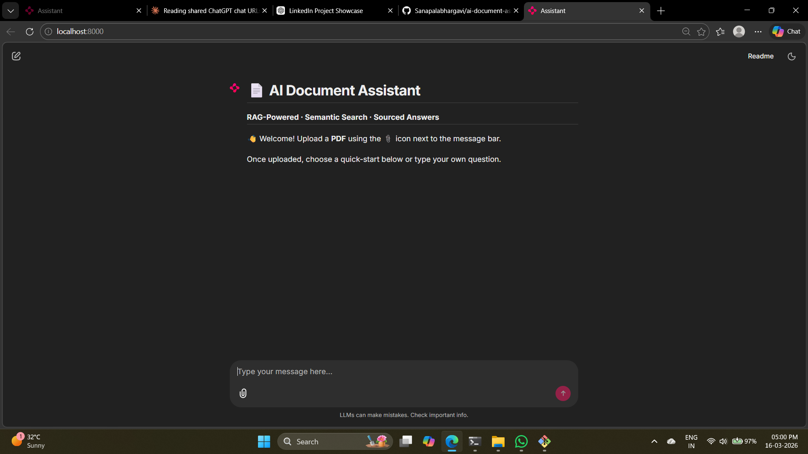

# 📄 AI Document Assistant (RAG-Based)

A ChatGPT-style document Q&A app built with **Chainlit**, **LangChain**, **FAISS**, and **Supabase** (free tier).

---

## ✨ Features

| Feature | Description |
|---|---|
| 🆕 New Chat | Starts a fresh session with welcome screen + starters |
| 📚 Chat History Sidebar | All chats persisted to Supabase — click any to resume |
| 📎 Upload PDF | Icon sits beside the prompt bar (Chainlit built-in) |
| 🏠 Home Page | Title, description, and 4 quick-start prompts |
| 🗑️ Clear History | Wipes all chats from the database |
| 📝 Summarise | One-click full document summary |
| 🏷️ Extract Keywords | **Extra feature** — finds top topics/terms in the doc |
| 🔍 Structured Answers | Bullet points + page-numbered sources for every answer |
| 💾 Supabase DB | Free, real-time Postgres — chat history survives restarts |
| ▶️ Resume Chat | Re-open any chat from sidebar and continue where you left off |

---

## 🗂️ Project Structure

```
ai-document-assistant/
│
├── app.py                  ← Chainlit application (main entry point)
├── rag_engine.py           ← RAG pipeline (embed, search, generate, keywords)
├── database.py             ← Supabase client + all DB operations
├── requirements.txt        ← Python dependencies
├── supabase_setup.sql      ← SQL to run in Supabase dashboard
├── .env.example            ← Copy to .env and fill in your keys
├── chainlit.md             ← Home page content (rendered on welcome screen)
├── .chainlit/
│   └── config.toml         ← Chainlit configuration (theme, features, etc.)
└── public/
    └── custom.css          ← Dark ChatGPT-style theme
```

---

## 🚀 Quick Start

### 1 — Clone / create the project folder

```bash
mkdir ai-document-assistant && cd ai-document-assistant
# copy all files here
```

### 2 — Set up Supabase (free, no credit card needed)

1. Go to [https://supabase.com](https://supabase.com) → **Start for free**
2. Create a new project (choose any region)
3. Go to **SQL Editor** → paste the contents of `supabase_setup.sql` → **Run**
4. Go to **Project Settings → API**
   - Copy **Project URL** → `SUPABASE_URL`
   - Copy **anon public key** → `SUPABASE_ANON_KEY`

### 3 — Configure environment

```bash
cp .env.example .env
# Edit .env and fill in your Supabase URL and key
```

```env
SUPABASE_URL=https://xxxxxxxxxxxx.supabase.co
SUPABASE_ANON_KEY=eyJhbGciOiJIUzI1NiIs...
```

### 4 — Install dependencies

```bash
pip install -r requirements.txt
```

> **Note:** First run will download the `flan-t5-large` model (~1.2 GB) and the MiniLM embedding model (~90 MB). These are cached locally after the first download.

### 5 — Run

```bash
chainlit run app.py
```

Open → **http://localhost:8000**

---

## 🧑‍💻 Usage Walkthrough

```
1. Open http://localhost:8000
2. You see the Home Page with 4 starter buttons
3. Click 📎 (beside the message bar) → upload a PDF
4. Wait for "✅ X pages indexed" confirmation
5. Click a starter or type your own question
6. Get a structured response:

   ### 🤖 Answer
   • Point one from the document
   • Point two from the document
   • Point three from the document

   ---

   ### 📌 Sources
     • 📄 Page 3 — "...snippet of relevant text..."
     • 📄 Page 7 — "...snippet of relevant text..."

7. Click "New Chat" in the sidebar to start fresh
8. Click any previous chat to resume it
9. Type "clear history" or "/clear" to wipe all chat history
```

---

## 🏷️ Extra Feature — Keyword Extraction

Click the **"🏷️ Extract keywords & topics"** starter to automatically identify the most-discussed terms in your document. Useful for:
- Quick document triage
- Research paper scanning
- Legal document review

---

## 🗄️ Database Schema

```sql
chats      (id, title, created_at, updated_at)
messages   (id, chat_id→chats, role, content, created_at)
documents  (id, chat_id→chats, filename, uploaded_at)
```

Supabase free tier gives you **500 MB** database + **2 weeks** of log retention — plenty for personal/team use.

---

## ⚠️ Known Limitations

- The FAISS vector index is **in-memory** — if the server restarts, you need to re-upload the PDF. The chat history (text) is fully persisted in Supabase.
- `flan-t5-large` is a capable but small model. For GPT-4 quality answers, swap the generator for the [Anthropic](https://docs.anthropic.com) or OpenAI API.

---

## 🔧 Swap the LLM (optional upgrade)

In `rag_engine.py`, replace the `_generator` pipeline with any API:

```python
import anthropic

client = anthropic.Anthropic()  # reads ANTHROPIC_API_KEY from env

def _call_llm(prompt: str) -> str:
    msg = client.messages.create(
        model="claude-opus-4-20250514",
        max_tokens=512,
        messages=[{"role": "user", "content": prompt}]
    )
    return msg.content[0].text
```

Then call `_call_llm(prompt)` instead of `_generator(prompt)[0]["generated_text"]`.


## Application Interface



